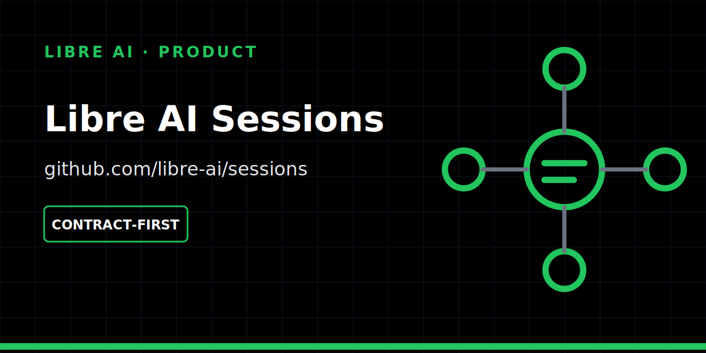

<p align="center">
  
</p>

# Libre AI Sessions

Source-grounded learning and facilitation sessions with citations, roles and bounded delegation.

[](https://github.com/libre-ai/sessions/actions/workflows/ci.yml)
[](https://github.com/libre-ai/sessions/actions/workflows/security.yml)
[](LICENSE)

## Status

| | |
| --- | --- |
| Maturity | **Contract-first** |
| Works today | deterministic Rust contracts, fixtures and server stubs |
| Not available yet | complete UI, durable storage, provider policy and production citation validation |
| Historical IDs | `rumble-lm-*` and `presto-*` identifiers are retained where they are code contracts |

Runtime scaffolding is evidence of boundaries, not a finished product claim.

## Contract proof

The P0 core validates a source-grounded session flow:

- sources and provenance are required;
- generated material remains draft-only until validation;
- participant exports exclude private responses by default;
- delegations are scoped, expiring, revocable and least-privilege;
- analytics are aggregate-only by default.

The fixture-only server exposes:

```text
GET  /p0/contract/proof
POST /p0/stub/run
```

Neither endpoint claims to call a real model provider, durable store or complete authorization infrastructure.

## Verify locally

```bash
cargo fmt --all --check
cargo clippy --workspace --all-targets --all-features -- -D warnings
cargo test --workspace
```

See [`docs/`](docs/) for the current contracts and testing notes.

## Boundaries

Sessions owns the learner, facilitator and participant workflow. It may hand off explicit source, planning, inspection and artifact contracts to independent infrastructure. It does not own generic ingestion, agent orchestration, client-platform primitives or long-term memory.

## Next milestone

Connect the P0 stub to a minimal grounded session with real citation outputs, explicit retention defaults and a documented BYOK/provider policy—without overstating readiness.

## Contributing

- [Contribution guide](CONTRIBUTING.md)
- [Roadmap](ROADMAP.md)
- [Security policy](SECURITY.md)

## License

[MIT](LICENSE).
