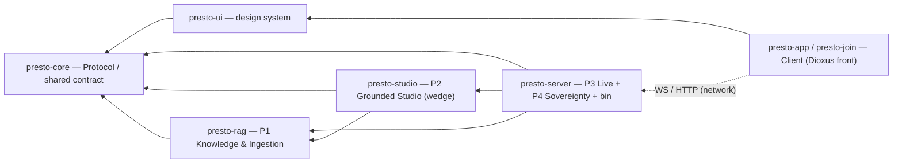

# ADR-0001 — Product Architecture & Brick Boundaries

- Status: Accepted
- Date: 2026-06-28
- Supersedes: none (first ADR)
- Related: docs/specs/2026-06-27-presto-matic-design.md, docs/plans/2026-06-27-p3-tracer-bullet.md, docs/specs/2026-06-28-collaborative-spaces-authz-design.md (SP-A), docs/specs/2026-06-28-signed-classification-clearance-design.md (SP-B), docs/specs/2026-06-28-frontend-dioxus-design-system-design.md (SP-C)

## Context

Presto-Matic is built by multiple agents working in parallel on one monorepo. Feature work advances
inside `crates/`. Without an explicit, shared picture of _where the boundaries between product bricks
are and why_, parallel work drifts: code lands in the wrong crate, dependencies creep the wrong way,
and the differentiators blur into the plumbing.

This ADR is the **north star** for those boundaries. It is deliberately a description of the _target_
and of the _principles for deciding boundaries_ — not a refactor order. Any agent can align its
objectives to it without cross-coordination.

Current state: one Cargo workspace, three backend crates (`presto-core`, `presto-rag`, `presto-server`),
~4090 lines, a single deployable binary, deployed on Clever Cloud; a placeholder web client in
`crates/server/static/`. Dependency graph today: `presto-core <- presto-rag <- presto-server`, acyclic.
The bricks below are each detailed in a spec (SP-A/B/C) — see Specified sub-projects.

## Product vision (the value the bricks serve)

Presto-Matic = **NotebookLM x Kahoot, sovereign and self-hostable**: source-grounded study content
(typed quizzes, SRS flashcards, grounded breakouts, summaries, mind maps), auto-generated from the
user's own corpus and delivered in real-time collaborative sessions (200+ participants).

**Center of gravity.** The daily, primary surface is the **personal grounded notebook** (a
NotebookLM-style workspace over the user's own corpus); the **live collaboration** is the
differentiator / moat layered on top — not the everyday surface. A personal notebook is the **degenerate
case of a shared space with a single member** (see SP-A), so solo → shared → live is one uniform model.

The **wedge is trust**: every generated item passes a grounding-verifier that confirms it is supported
by its cited source alone — the anti-hallucination gate before content reaches a live session. This
verifier is also the bridge to the agentic harness (Agent-O-Matic): the harness's "gate" principle
applied to generated content.

Sovereignty is a first-class constraint: BYO keys, Clever Cloud + Clever AI by default, EU residency,
RGPD, no US hyperscalers, OSS-friendly licensing (MIT/Apache/MPL only).

Differentiators: real-time live engine (#1), typed questions (#2), mastery + spaced repetition (#3),
grounded breakouts from the confusion heatmap (#4) — all under the trust wedge.

## The product bricks (+ one shared contract)

| Brick                              | Product capability                                                                    | Responsibility (modules)                                                                                                    | Today                 | Target crate                                                     |
| ---------------------------------- | ------------------------------------------------------------------------------------- | --------------------------------------------------------------------------------------------------------------------------- | --------------------- | ---------------------------------------------------------------- |
| **P1 — Knowledge & Ingestion**     | Turn sovereign sources into a groundable corpus                                       | `provider` (LLM access), `corpus` (retrieval, pgvector+FTS), `ingest` (chunk -> embed)                                      | `presto-rag`          | `presto-rag`                                                     |
| **P2 — Grounded Studio**           | Generate pedagogical content always traceable to source, gated by the verifier        | `generate`, `verify` (the wedge), `flashcards`, `clarify`, `pipeline`                                                       | `presto-rag`          | `presto-studio` (to extract)                                     |
| **P3 — Live Sessions**             | Orchestrate 200+ participants in real time: quiz flow, leaderboard, confusion heatmap | `session`, `store`/`postgres_store`, `fanout`/`redis_fanout`, `ws`, `http`, `quiz` (ports)                                  | `presto-server`       | `presto-server`                                                  |
| **P4 — Sovereignty & Self-host**   | Auth, **collaborative spaces, classification**, BYO/multi-instance, quotas/audit/RGPD | `auth` + `space`/`membership`/`oidc`/`audit` (SP-A) + classification (SP-B) + env wiring                                    | `presto-server`       | modules in `presto-server`; extract `presto-authz` when it grows |
| **Client — Front & design system** | The surfaces users touch: personal notebook (owner) + guest/join client               | `presto-ui` (design system), `presto-app` (notebook), `presto-join` (guest) — Dioxus, all-Rust (SP-C)                       | `static/` placeholder | `presto-ui` + `presto-app` + `presto-join`                       |
| **Transverse — Protocol**          | Data contract between bricks and clients                                              | content types (`Question`, `Flashcard`, `QuestionKind`) + live wire protocol (`Client`/`ServerMessage`, `LeaderboardEntry`) | `presto-core`         | `presto-core`                                                    |

## Architecture — two views

### Value flow (product)

```
   Sources (documents)
        |  ingest -> embed -> retrieve
        v
  +------------------+   corpus   +-----------------------+  grounded  +------------------+
  | P1  Knowledge    | ---------> | P2  Grounded Studio   | ---------> | P3  Live         | --> 200+ participants
  |     & Ingestion  |            |   generate -> verify  |  (gated)   |     Sessions     |
  +------------------+            +-----------------------+            +------------------+
        \---------------- all under P4  Sovereignty & Self-host ----------------/
```

The **Client** is the surface over all of this: the owner's **notebook app** (the daily, primary
surface) and the guests' **join client** (ephemeral, live). It talks to the backend over the network.

### Dependency graph (code) — the invariant



**Invariant (non-negotiable):** dependencies point one way, toward the core. A brick never depends on a
brick downstream of it. The live engine knows the studio; the studio never knows the live engine; the
studio knows the RAG engine; the RAG engine never knows the studio. **The Client shares `presto-core`
(the contract) and reaches the backend over the network (WS/HTTP) — never a code dependency on a backend
brick.** The arrow holds across the front/back boundary too.

### Ports & adapters (already healthy — keep it)

The live engine (P3) owns the **ports** it needs (`QuizSource`, `BreakoutSource`, `FlashcardSource`,
`DocumentIngestor`, defined in `server/quiz.rs`). Their **adapters** (`RagQuizSource`, ...) live at the
composition point (server), calling into the studio/rag and selectable fixture <-> RAG at startup.
Upstream bricks expose pure APIs and know nothing about "sessions". This keeps the dependency invariant
intact. New content capabilities follow the same shape: a pure function in the studio, an adapter behind
a port in the server.

## Specified sub-projects

Each brick is detailed in its own spec, delivered in **risk-first increments** (wedge core first):

- **SP-A — Collaborative spaces & authz** (P4 substrate): OIDC (Keycloak) in front, Biscuit authz
  behind, membership in Postgres (token is never a cache); durable + ephemeral invitation; bounded
  delegation; revocation via short TTL + recheck. Personal notebook = single-member space.
- **SP-B — Signed classification & clearance** (P4 × P1): three **orthogonal signed assertions**
  (confidentiality / pii / integrity), not one risk scalar; hybrid clearance `min(org, space)`; the
  **live-generation gate** (a host generates live content only from `confidentiality <= audience
clearance`). Integrity serves the solo wedge; access gating is collaborative.
- **SP-C — Front & design system** (Client): all-Rust **Dioxus** (web wasm + Tauri desktop),
  `presto-ui` on tokens with hand-built a11y, `presto-app`/`presto-join` surfaces sharing `presto-core`;
  server-authoritative. UniFFI and true multi-native are rejected (anti-sovereign, wedge friction).

## Principles for boundaries (how to decide — reusable)

1. **Crate != repo.** A crate is a compile/API boundary; a repo is a governance/deployment boundary.
   Modularity is solved by crates. Reach for a repo only when governance diverges (different git
   visibility for open-core; independent release cadence for an external consumer).
2. **Reify a boundary only when it has all three:** strong internal cohesion, weak/acyclic external
   coupling, and an independent reason to vary (deployment, external reuse, governance, or a heavy
   dependency split). Two of three is not enough.
3. **Dependencies flow one way** (the invariant above). When unsure where code belongs, ask which brick
   may depend on which — and never break the arrow.
4. **Ports belong to the consumer; adapters live at the composition point.** Upstream bricks stay
   ignorant of downstream ones.
5. **Decide late, keep options open.** Clean crate seams already pay the _option_ of a future split
   (repo, OSS extraction) at near-zero cost. Don't pay the cost (multi-repo ceremony, premature split)
   before a real boundary exists. One-way doors (publishing OSS, splitting a repo) are closed as late as
   possible.

## Gap: current -> target

### The one split worth doing — extract P2 (studio) from P1 (rag)

`presto-rag` fuses P1 (infra) and P2 (studio). The intra-crate graph proves the seam is clean and acyclic:

- **P1:** `provider` (leaf), `corpus -> provider`, `ingest` (leaf) — carries the heavy deps
  (`sqlx`, `reqwest`, pgvector).
- **P2:** `generate`, `verify`, `flashcards`, `clarify`, `pipeline` — **all depend on P1; none of P1
  depends on P2.** `presto-rag` imports from core only the content types; no live type leaks in.

Target: `presto-rag` (P1, reusable sovereign RAG engine) + `presto-studio` (P2, grounded generation,
home of the wedge), with `presto-studio -> presto-rag`. This serves cohesion, external reuse (a third
party can take the RAG engine without the quiz generators), and makes the grounding-verifier visible as
the strategic brick it is.

**Sequencing:** perform on green, after the in-flight ingestion (P11) work merges — never refactor over
uncommitted WIP in `crates/rag/`.

### Second-order tidy — core mixes content and live protocol

`presto-core/protocol.rs` holds both content types (`Question`, `Flashcard`, `QuestionKind` — used by
rag/studio) and the live wire protocol (`Client`/`ServerMessage`, `LeaderboardEntry` — used only by the
live engine; rag imports none of them). For cohesion, the content types are the true shared core; the
live protocol belongs with the live engine. SP-B also adds the `Level` (confidentiality) type here, as a
transverse contract. Low priority vs the P1/P2 split — fold in if convenient, otherwise defer.

### Non-gaps — boundaries deliberately NOT reified (avoid over-splitting)

- **auth (P4) split from the live engine:** P4 is now **specified** (SP-A authz + SP-B classification)
  and **will** grow well beyond `auth` — spaces, membership, OIDC, audit, quotas, classification. The
  wedge-core stays as modules in `presto-server`; extract a `presto-authz` crate once the collaborative
  increments (SP-A inc-2/3, SP-B) land — a real cohesion + reuse boundary by then, not before.
- **transport (ws/http/fanout) split from session/quiz:** rejected. The seam already exists at module
  level (`session.rs` is the pure async-free state machine; `ws.rs` is transport). Reifying it for ~960
  lines is ceremony.
- **one-crate-per-brick for the backend:** rejected at ~4k lines. Bricks stay module-level where the
  seam is weak; crate-level only where it is strong (P1/P2, and the Client which is a separate surface).
- **multi-repo today:** rejected. No governance boundary is live. The harness can consume any brick via a
  git-dependency to the sub-crate (`package = "presto-rag", tag = "..."`) — no split required.

## Deferred decision — open-core governance line

If a partial-OSS model is later chosen, the visibility line would put the engine
({`presto-core` content, `presto-rag`, `presto-studio`}) public and the product (`presto-server` + live
protocol, plus the Client) private — and only _that_ (different git visibility) would force a second
repo. Not decided here. Until then, the monorepo keeps the option open at near-zero cost.

## Goals & invariants for the feature agent (actionable now, no refactor required)

- **Respect the dependency arrow** `core <- rag <- (studio) <- server`, and `core <- ui <- app/join` for
  the front. Never introduce an upstream-to-downstream dependency; the front never imports a backend
  brick (it uses the network).
- **Place new code by brick:** retrieval/ingestion/provider -> P1 (`presto-rag`); generation/verification/
  flashcard/breakout logic -> P2 (today still in `presto-rag`, treated as the future `presto-studio`);
  session/transport -> `presto-server`; auth/spaces/membership/classification -> P4 (server modules per
  SP-A/SP-B); UI/components/tokens -> the Client crates (SP-C).
- **Keep P2 modules free of any `presto-server` import** (`generate`, `verify`, `flashcards`, `clarify`,
  `pipeline`) so the future extraction stays a _move_, not a rewrite.
- **Keep heavy deps (`sqlx`/`reqwest`) out of P2 logic** — they belong to P1. A studio module needing
  storage/HTTP goes through a P1 API, not a direct dep.
- **Ports stay in the consumer, adapters at the composition point.** New content capability = pure studio
  function + server-side adapter behind a port.

Scheduled (post-P11, on green): extract `presto-studio` from `presto-rag` per the seam above; rewire the
server adapters to call `presto-studio`; keep one workspace-wide CI run green.

## Consequences

- A shared, explicit target lets parallel agents align without coordination overhead.
- The grounding-verifier (the wedge) gets a visible, named home.
- The RAG engine becomes cleanly reusable / OSS-extractable later, at the cost of one well-scoped split
  done on green.
- The Client is a first-class brick sharing only the `presto-core` contract — UI work and backend work
  cannot tangle by construction.
- No premature multi-repo or over-splitting cost is paid now.
