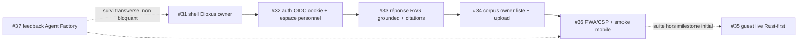

# Plan canonique — recalage `mobile-webview-mvp`

- **Statut :** planification vérifiée, aucune disponibilité produit déclarée
- **Date de vérification :** 2026-07-12
- **Baseline auditée :** `0a7d1261de168ca7a3498a03f4d18f7307c07bc6`
- **Tracker :** [milestone `mobile-webview-mvp`](https://github.com/libre-ai/sessions/milestone/1)
- **Décisions :** [ADR-0001](../adr/0001-product-architecture-and-boundaries.md), [ADR-0002](../adr/0002-mobile-first-webview-rust-core.md), [SP-A](../specs/2026-06-28-collaborative-spaces-authz-design.md), [SP-C](../specs/2026-06-28-frontend-dioxus-design-system-design.md)

Ce document est le graphe de livraison canonique des issues
[#31](https://github.com/libre-ai/sessions/issues/31) à
[#37](https://github.com/libre-ai/sessions/issues/37). Il décrit un ordre et des
preuves attendues, pas une date de livraison ni un niveau de maturité atteint.

## Résultat visé et limite du milestone initial

Le premier parcours utilisable est le **notebook owner authentifié** :

> ouvrir le shell mobile → se connecter via le Keycloak de développement →
> retrouver son espace personnel → demander une réponse RAG → voir une réponse
> acceptée par le verifier et ses citations → ajouter un document texte/Markdown
> puis l'interroger → rafraîchir/se déconnecter → installer et tester le shell PWA.

Le client guest live [#35](https://github.com/libre-ai/sessions/issues/35)
est une suite, après preuve du parcours owner. Il ne fait pas partie du milestone
initial et ne peut pas servir à déclarer celui-ci utilisable.

## Baseline réelle

| Surface | Existe au commit audité | Manque avant acceptation |
| --- | --- | --- |
| Contrats client Rust | `crates/core/src/api.rs` fournit `CurrentUser`, `CurrentSpace`, `RagQueryRequest`, `RagQueryResponse` et `SourceCitation`; `crates/core/src/client.rs` fournit les états auth/RAG | contrats documents; handlers réseau des routes notebook |
| UI produit | `crates/ui` est le package `rumble-lm-ui`; primitives Dioxus, tokens Portal, `SourceCard`, `BottomNav`, tests SSR et gate `wasm32` existent | application Dioxus routée, état/runtime navigateur, bundle servi sous `/app` |
| Serveur web | `/` et `/app.js` servent un client statique JS de session live; `/sessions`, `/sessions/{id}/participants`, `POST /corpus/documents` et `/ws/{id}` existent | `/app`, routes auth web, `/api/me`, `/api/spaces/current`, `/api/rag/query`, liste/upload owner sous `/api` |
| Auth | validation de claims/signature/issuer/audience/nonce dans `crates/server/src/oidc.rs`; seams Biscuit, authz et membership en mémoire | discovery/JWKS/rotation, Authorization Code + PKCE, état login, callback, cookie web, bootstrap de l'espace personnel, CSRF et E2E Keycloak |
| RAG | ingestion/récupération scindées par `RetrievalScope`; pipeline quiz `retrieve → generate → verify`; citations live; séparation de prompt via `fenced_source` | orchestration de réponse notebook, handler `/api/rag/query`, projection de citations autorisée, preuve E2E owner |
| Corpus | `POST /corpus/documents` accepte aujourd'hui du texte brut/Markdown et alimente l'ingestor configuré | API owner authentifiée et isolée par espace, contrats/listage, UI mobile, preuve upload→query; pas de suppression sûre déclarée |
| Tests navigateur | Playwright couvre le client statique live sur Chromium desktop | profil mobile notebook, auth réelle de développement, parcours owner, matrice cross-browser demandée par SP-C |
| PWA | aucun manifest, service worker, jeu d'icônes ou CSP PWA n'est présent | installabilité, cache du shell seulement, CSP, smoke appareil et documentation |

Le client statique live est une preuve utile du protocole existant. Ce n'est ni le
shell Dioxus owner, ni une preuve PWA, ni une implémentation de l'auth OIDC web.

## Graphe de livraison



**Chaîne critique durable :** shell → authentification → RAG → corpus → PWA.
[#37](https://github.com/libre-ai/sessions/issues/37) suit les lacunes génériques
sans remplacer les gates locales. [#35](https://github.com/libre-ai/sessions/issues/35)
reste ouverte hors milestone initial.

| Issue | Dépend de | Preuve de sortie minimale |
| --- | --- | --- |
| [#31](https://github.com/libre-ai/sessions/issues/31) | #28, #29, #30 (fermées) | `rumble-lm-app` compile native + WASM; `/app` sert le shell; navigation mobile Playwright sans faux login |
| [#32](https://github.com/libre-ai/sessions/issues/32) | #31 | Code + PKCE contre Keycloak dev; cookie `HttpOnly; Secure; SameSite=Strict`; `/api/me` et `/api/spaces/current`; refresh/logout et contrôles CSRF |
| [#33](https://github.com/libre-ai/sessions/issues/33) | #32 | route RAG réelle; rejet distinct; citations; gate source/verifier et test adversarial CI bloquant |
| [#34](https://github.com/libre-ai/sessions/issues/34) | #33 | liste/upload owner isolés par espace; upload texte/Markdown puis requête qui cite ce document |
| [#36](https://github.com/libre-ai/sessions/issues/36) | #34 | manifest/service worker/icônes/CSP; smoke mobile local; instructions appareil; tests web fonctionnels cross-browser |
| [#35](https://github.com/libre-ai/sessions/issues/35) | parcours owner prouvé (#31–#34 et #36) | un round guest complet en client Rust-first; hors milestone initial |
| [#37](https://github.com/libre-ai/sessions/issues/37) | transverse | liens Agent Factory vérifiés et écarts génériques suivis; aucune attente sur #14 pour le premier vertical |

## Routes et propriété des contrats

Les routes ci-dessous sont **cibles** tant qu'une issue ne les a pas livrées et
testées. Les DTO partagés appartiennent à `presto-core`; les handlers et décisions
d'autorisation appartiennent à `presto-server`; le client ne dépend jamais du
crate serveur.

| Route cible | Issue | Autorité et comportement |
| --- | --- | --- |
| `GET /app` et fallback `/app/*` | #31 | sert le bundle `rumble-lm-app`; ne remplace pas encore `/`, la preuve live existante |
| `GET /auth/login` | #32 | crée état, nonce et PKCE côté serveur puis redirige vers Keycloak |
| `GET /auth/callback` | #32 | échange le code, valide l'ID token via discovery/JWKS, bootstrap l'espace owner, pose le cookie |
| `POST /auth/logout` | #32 | invalide/expire la session web sans exposer le token au client |
| `GET /api/me` | #32 | projette `CurrentUser`, jamais le token ni des claims bruts |
| `GET /api/spaces/current` | #32 | projette l'espace personnel et les capacités accordées par le serveur |
| `POST /api/rag/query` | #33 | reçoit `RagQueryRequest`; vérifie cookie/espace/capability/clearance; ne projette `Grounded` que depuis un `ApprovedAnswer` du registre serveur versionné |
| `GET /api/corpus/documents` | #34 | liste les résumés de l'espace personnel authentifié, sans contenu brut par défaut |
| `POST /api/corpus/documents` | #34 | upload texte/Markdown borné; l'espace vient de l'identité autorisée, pas d'un champ client de confiance |

Le `POST /corpus/documents` existant reste une route d'ingestion du runtime live.
Il n'est pas une preuve de l'API owner authentifiée et ne doit pas être renommé ou
supprimé implicitement par ce milestone.

## État d’implémentation #33 (2026-07-12)

La verticale est implémentée sur sa branche de revue : registre immutable d’un
claim public versionné/hashé avec provenance de contrôle, route owner bornée et
`no-store`, états Dioxus complets et E2E Playwright déterministes. Le corpus
owner reste un placeholder pour #34. L’acceptation définitive reste soumise à la
revue de la PR ; ce paragraphe ne déclare ni merge ni disponibilité produit.

La propriété obtenue est l’appartenance à l’univers serveur explicitement
approuvé et scoped, pas la vérité ou l’entailment arbitraire. Voir
[`security/approved-notebook-claims.md`](../security/approved-notebook-claims.md).

## Gate de sécurité RAG — bloquant pour #33

Le risque S1 documenté dans
[la spécification d'évolution](../evolution/2026-06-28-evolution-and-hardening-spec.md)
porte sur la source non fiable lue à la fois par le générateur et le verifier.
L'existant apporte seulement des défenses en profondeur :
`crates/rag/src/lib.rs::fenced_source` maintient une frontière syntaxique, et
`verify.rs` rejette un booléen provider lorsque l'extrait ou la réponse sont
absents de la source scoped. Ni les fences ni ce matching exact ne prouvent qu'un
modèle ignore une instruction source. Une instruction ou fausse affirmation qui
contient la réponse peut encore passer le gate lexical. Le test réel-provider
`crates/server/tests/live_rag.rs::host_generates_a_question_grounded_in_an_ingested_document`
reste conditionné à une route AI approuvée et ne ferme pas cette limite.

En conséquence, #33 ne peut être accepté « grounded » que si :

1. une autorité indépendante de claims approuvés, construite côté serveur et non
   choisie par le provider ou la source non fiable, autorise chaque claim publié;
2. si un futur provider est ajouté au Notebook, son prompt réutilise les fences
   et le matching exact comme défense en profondeur fail-closed, sans jamais
   sélectionner/créer un claim ni devenir cette autorité ; le MVP déterministe
   n’appelle aucun provider ;
3. les tests déterministes couvrent les deux frontières : rejet d'une réponse
   absente malgré `supported=true`, et acceptation lexicale transparente d'une
   instruction source contenant elle-même la réponse;
4. une erreur/indécision du verifier ou de l'autorité produit `Rejected` ou une
   erreur bornée, jamais `Grounded`;
5. les citations sont une projection autorisée : aucun texte confidentiel brut,
   prompt, verdict interne ou token n'est renvoyé/loggé ;
6. le terme `grounded` signifie ici « membre du registre approuvé pour cet espace
   et cette clearance », pas « vrai » ni « sémantiquement entailé ».

[#33](https://github.com/libre-ai/sessions/issues/33) est le tracker de cette
condition pour le nouveau vertical; aucun doublon sécurité séparé n'est requis à
ce stade.

## Gates transverses du milestone

Chaque incrément reste vert et réversible :

```bash
cargo fmt --all --check
cargo clippy --workspace --all-targets --all-features -- -D warnings
cargo test --workspace --all-features
cargo check -p presto-core -p rumble-lm-ui --target wasm32-unknown-unknown
```

À partir de #31, le package app est ajouté au gate WASM. À partir de #32, le test
Keycloak de développement et les assertions cookie/CSRF sont bloquants. À partir
de #33, le test adversarial ci-dessus est bloquant. À partir de #36, le smoke
mobile et les scénarios fonctionnels Chromium/Firefox/WebKit sont bloquants.

Règles permanentes :

- aucun token dans JavaScript/WASM, URL, stockage web ou logs;
- aucune police/CDN/SaaS frontend distant;
- le serveur reste autoritaire pour droits, clearance et grounding;
- aucune donnée d'un autre espace dans retrieval, documents ou citations;
- aucun déploiement, release, shell natif ou offline RAG implicite dans ce plan.

## Feedback Agent Factory

Les lacunes génériques consolidées sont suivies dans :

- [`libre-ai/agent-factory#12`](https://github.com/libre-ai/agent-factory/issues/12) — domaine mobile/WebView Rust-core;
- [`libre-ai/agent-factory#13`](https://github.com/libre-ai/agent-factory/issues/13) — template de gate `wasm32`;
- [`libre-ai/agent-factory#14`](https://github.com/libre-ai/agent-factory/issues/14) — scaffold plan → milestone/issues.

#12 et #13 n'empêchent pas l'emploi des gates locales déjà explicites. #14 est
une amélioration de planification et **ne bloque pas le premier vertical owner**.

## Non-objectifs

- client guest live dans le milestone initial (#35 reste une suite ouverte);
- OAuth dans un WebView natif, Tauri, SwiftUI/Compose ou stores mobiles;
- collaboration durable, invitations riches ou modèle de permissions complet;
- PDF/OCR, suppression documentaire sans cascade prouvée, streaming RAG;
- offline RAG ou mise en cache de corpus/réponses par le service worker;
- déclaration alpha/production, release ou déploiement.
