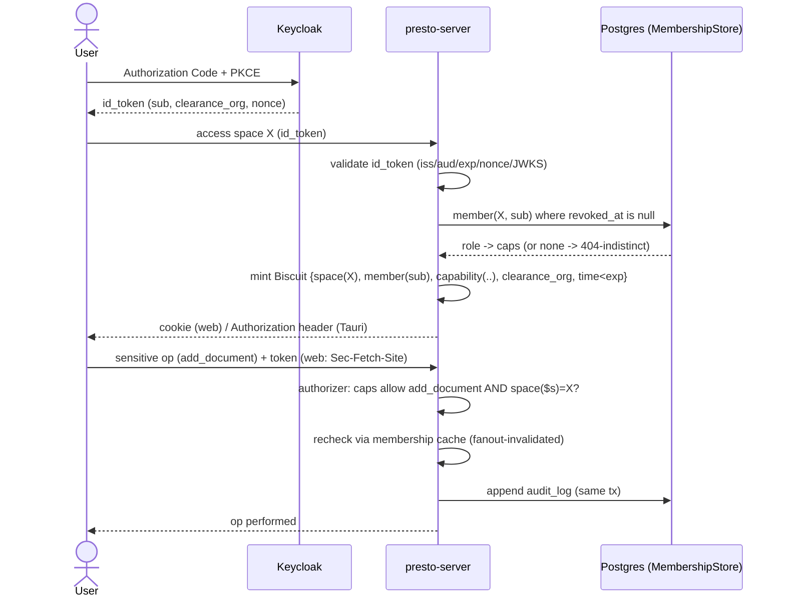

# Collaborative Spaces & Authorization — Design Spec (SP-A)

- Status: Proposed
- Date: 2026-06-28
- Related: docs/specs/2026-06-27-presto-matic-design.md (P4), docs/adr/0001-product-architecture-and-boundaries.md (brick P4), crates/server/src/auth.rs (existing join-link Biscuit)
- Scope: P4 — Sovereignty & Self-host, the **authorization substrate**. Classification (confidentiality / PII / integrity) and clearance-based access are **SP-B**.

## Context

Presto-Matic is a **personal grounded notebook** (the daily surface) with a live-collaboration differentiator on top. Sharing a notebook — adding members, inviting on the fly, delegating who may add documents or invite others — needs an authorization substrate that federates identity to a sovereign IdP (Keycloak/OIDC), expresses capabilities/delegation with Biscuit, keeps **membership as the single source of truth in Postgres**, mints tokens **at access time** (never a cache), and supports durable + ephemeral invitation with **immediate revocation**.

`crates/server/src/auth.rs` already mints/verifies Biscuit join-links (sole emitter, Ed25519, injected-clock, authorizer, self-expiry). SP-A **generalizes** it from `session` to `space` and adds OIDC + attenuation. It does not rewrite it.

## Delivery increments (risk-first, wedge-first)

The target below is the full P4. It is **not** built at once — the wedge (personal notebook + live) only needs the core. Each increment is independently shippable and green.

- **Increment 1 — Wedge core** (authenticated personal notebook + existing live):
  OIDC pipeline; solo-space bootstrap; generalized minting (`session→space`, atomic caps, `requested_space` isolation); existing anonymous live join-links keep working; `MembershipStore` seam (owner-only); token transport; error taxonomy + anti-enumeration. Data: `space`, `space_member` (owner), `document.space_id`.
- **Increment 2 — Durable collaboration:**
  durable membership + roles (viewer→admin), idempotent upsert; revocation (short TTL + tightened recheck + fanout cache invalidation); audit of sensitive actions; role/ownership policy + transfer + orphan-owner rule.
- **Increment 3 — Rich invitation & governance:**
  capability-links (anonymous multi-use + invite-to-register single-use CAS); bounded delegation; identity resolution (invite-link default, Keycloak directory optional); quotas, notifications; corpus `space_id` scoping (coordinated with P1); transport hardening derived from SP-B `risk_level`.

## The personal notebook is a single-member space

Not a separate path: a `space` whose only member is the `owner`. On a user's first OIDC login (unknown `sub`), the server auto-creates a personal space (idempotent). Sharing = adding members; live collab = a `session` inside the space.

## Three layers (invariant)

| Layer                     | Answers                                           | Lives in               | Must NOT                  |
| ------------------------- | ------------------------------------------------- | ---------------------- | ------------------------- |
| **Authn** — Keycloak/OIDC | _who are you_ (identity, groups, `clearance_org`) | sovereign IdP          | know what a "space" is    |
| **Membership** — Postgres | _who is a member of which space, with which role_ | `space_member`         | live in Keycloak          |
| **Authz** — Biscuit       | _what this bearer may do, here, now_              | token minted at access | be a permission **cache** |

**Token-is-not-a-cache.** The Biscuit encodes the capability minted at access from OIDC identity + DB membership; the DB stays the authority on _current_ membership (basis of immediate revocation).

## A. Authentication pipeline

**OIDC validation (total).** Module `oidc`, **Authorization Code + PKCE** (never implicit). Discovery at boot; **JWKS cached by `kid`**, refreshed on unknown `kid` (rotation). Every `id_token`: signature (JWKS) → `iss` → `aud=client_id` → `exp/nbf/iat` (bounded skew) → `nonce` == server-stored (anti-replay) → extract `sub`, `clearance_org`. Any failure → `Unauthenticated`.

**Token transport — per surface (corrected).** The Biscuit is never in `localStorage`.

- **Web / PWA:** cookie `HttpOnly; Secure; SameSite=Strict` + server-side **`Sec-Fetch-Site`** check (CSRF).
- **Tauri desktop:** no browser cookie/CSRF model — token in the native process, sent via `Authorization` header, stored in the OS secure store.
  Residual theft risk (stolen cookie/token within TTL) → short TTL + sensitive-op recheck. Hardening (Increment 3): DPoP-style proof-of-possession, **scaled to the space `risk_level`** (a "secret" space requires it; an "internal" one does not).

**Error taxonomy (non-leaky).** `AuthzError { Unauthenticated, Forbidden, NotFound, Revoked, Expired, RateLimited }`. Mapping: `Forbidden | NotFound | Revoked → 404` (uniform); `Unauthenticated | Expired → 401`; `RateLimited → 429`. Errors never carry the token.

## B. Access decision & isolation

**Space isolation.** Generalize `requested_session` → `requested_space`; every op states its target space; the authorizer requires `space($s), requested_space($s)`. A token for X can never act on Y.

**Role / ownership.** Ordered roles `viewer < contributor < inviter < admin < owner`. Assigning a role requires `manage_members` **and** `assigned_role <= actor_role` (no over-minting, no self-promotion). `space.owner_sub` is the single source of truth; exactly one owner; transfer is one audited transaction `{old→admin, owner_sub:=new, new→owner}`. **Orphan owner:** if the owner's IdP account is disabled/deleted, the space is flagged and ownership auto-transfers to the senior admin (or is archived if none) — an audited, scheduled reconciliation, never left ownerless.

**Anti-enumeration.** {not a member, does not exist, revoked} collapse into one `Denied` → an **identical 404 body**. (We aim for a uniform response body; perfectly constant timing is not promised — the membership path does more work than the short-circuit, and chasing constant-time here is rarely worth it.)

## C. Invitation & capability-links

**Durable membership.** An `invite` holder resolves the invitee, then `INSERT space_member … ON CONFLICT (space_id, member_sub) DO UPDATE SET role=…` (idempotent, audited). Next connection → Biscuit with the membership's caps. Revoke = `revoked_at`.

**Capability-link (ephemeral).** Biscuit attenuated from the issuer: caps ≤ issuer, short TTL, never `invite`/`manage_members`. **anonymous** = multi-use within TTL (live), revocable; **invite-to-register** = single-use, redeemed via atomic CAS `UPDATE … SET consumed_at=now() WHERE id=$1 AND consumed_at IS NULL AND single_use RETURNING id` (0 rows ⇒ deny).

**Identity resolution (corrected — link-first).** Default = **invite-by-link** (works with any OIDC IdP, keeps the BYO-IdP promise, no privileged directory). **Optional** = Keycloak directory (Admin REST `users?email=`, minimal-scope service-account) when the IdP supports it — returns only resolved/not-resolved (no list → no email enumeration), restricted to `invite` holders.

## D. Data & persistence

**Documents scoped to a space.** `document.space_id`. The pgvector corpus must filter `WHERE space_id = $current` (inter-space isolation = security). **Corrected sequencing:** this is a `Retriever`/`corpus.rs` change in **brick P1** — coordinate with the ingestion (P11) work, do not decree it from the authz side; and keep the ADR invariant: the `Retriever` _receives_ `space_id` as a parameter, never depends on P4. (Increment 3.)

**`MembershipStore` seam.** The recheck goes through a trait (unit-testable without a DB, consistent with `SessionStore`/`Fanout`):

```rust
#[async_trait]
trait MembershipStore {
    async fn member(&self, space: SpaceId, sub: &Sub) -> Option<Membership>; // None = absent/revoked
    async fn upsert_member(&self, space: SpaceId, sub: &Sub, role: Role, by: &Sub) -> Result<(), StoreError>;
    async fn revoke_member(&self, space: SpaceId, sub: &Sub) -> Result<(), StoreError>;
    async fn list_members(&self, space: SpaceId) -> Result<Vec<Membership>, StoreError>;
}
```

Impls: `PostgresMembershipStore`, `InMemoryMembershipStore`.

**Concurrency / idempotence.** Re-invite = upsert. Role changes + their audit row in one transaction; sensitive ops recheck inside their transaction (`SELECT … FOR UPDATE` when mutating). READ COMMITTED + row locks suffice.

**Migration.** Idempotent: a personal space per existing user; current `session`/corpus rows attached to a legacy space.

## E. Revocation — short TTL + tightened recheck (corrected)

- Short TTL (~15 min).
- **Recheck only on a tight "sensitive" set:** `add_document`, `invite`, `manage_members`, `delete_space`, and — via SP-B — reading a **confidential** doc. Ordinary RAG retrieval/reads do **not** hit a synchronous membership lookup.
- For the recheck, a **short membership cache (5–10 s) invalidated on revoke via the existing Redis fanout** keeps the hot path off the DB while preserving near-immediate revocation. The fanout already propagates live events; revocation rides the same backplane.
- Chosen over TTL-only and epoch-counter.

## F. Governance

**Audit.** `AuditSink::record(event)` in the **same transaction** as the action (no action without a trace; if audit later externalizes, switch to an outbox pattern). Append-only table; fields `actor/action/target/space/at`; **no raw PII**. Retention configurable (DORA). Tamper-evidence (hash-chain) = open item.

**Quotas & notifications.** Configurable quotas (`max_members_per_space`, `max_spaces_per_user`, `max_links_per_space`) enforced at create/invite/link. Membership changes emit an event for an out-of-band notifier (email/in-app) — only the hook is in scope.

## Components & placement

Brick **P4** as modules in `presto-server`: `oidc`, `space`, `membership` (`MembershipStore` + impls), generalized `auth.rs`, `audit`. Extract `presto-authz` when P4 grows (quotas/RGPD/retention), per ADR-0001.

## Data model

```sql
space ( id uuid pk, owner_sub text not null, name text not null, created_at timestamptz not null default now() );
space_member ( space_id uuid not null references space(id), member_sub text not null,
  role text not null, invited_by_sub text, created_at timestamptz not null default now(),
  revoked_at timestamptz, primary key (space_id, member_sub) );
document ( id uuid pk, space_id uuid not null references space(id),
  created_by_sub text not null, created_at timestamptz not null default now() ); -- SP-B adds classification cols
capability_link ( id uuid pk, space_id uuid not null references space(id), caps text[] not null,
  expires_at timestamptz not null, single_use boolean not null default false, consumed_at timestamptz,
  created_by_sub text not null, revocation_id text not null unique, revoked_at timestamptz );
audit_log ( id bigserial pk, space_id uuid not null references space(id),
  actor_sub text not null, action text not null, target text, at timestamptz not null default now() );
```

The pgvector corpus gains a `space_id` column (Increment 3, coordinated with P1).

## Capability model

| Role        | read | contribute | add_document | invite | manage_members | delete_space |
| ----------- | ---- | ---------- | ------------ | ------ | -------------- | ------------ |
| viewer      | ✓    |            |              |        |                |              |
| contributor | ✓    | ✓          | ✓            |        |                |              |
| inviter     | ✓    | ✓          | ✓            | ✓      |                |              |
| admin       | ✓    | ✓          | ✓            | ✓      | ✓              |              |
| owner       | ✓    | ✓          | ✓            | ✓      | ✓              | ✓            |

Caps are Biscuit facts. Delegation least-privilege: `invite` non-delegable by default; a link cannot mint another link; monotone attenuation guarantees no delegate exceeds its issuer.

## Mint / verify flow



## User stories

Owner creates a space (solo by default) and adds documents; owner/admin invites by link (or Keycloak-resolved) at a role ≤ their own; owner/admin revokes with immediate effect; inviter generates a link for live guests; invited member authenticates and gets exactly their role's caps; owner transfers ownership (always one owner); guest joins a live meeting anonymously and cannot re-invite.

## How it extends `auth.rs`

Keep: sole-emitter, Ed25519 key, injected-clock minting, authorizer pattern, self-expiry, `AuthError` never carrying the token. Generalize: `session(id)`→`space(id)`; `Capability{Host,Participant}`→atomic caps; live token = `space+session+caps`. Add: OIDC front, attenuation, `mint_space_token` over `MembershipStore`, tightened recheck, audit, `requested_space`.

## Relation to SP-B

SP-A carries `clearance_org` and scopes documents to a space. SP-B adds signed `confidentiality`/`pii`/`integrity` (third-party blocks), `allow if clearance >= confidentiality`, `pii.special => confidentiality >= confidential`, and `effective_clearance = min(clearance_org, space_grant)`. The SP-A transport hardening (DPoP) keys off SP-B's `risk_level`.

## Testing strategy

Unit (mock `MembershipStore`): space-cap roundtrip; attenuation strictly smaller; link cannot re-mint; expired rejected; token for A cannot open B; role assignment cannot exceed issuer. OIDC: reject bad `iss/aud/exp/nonce/signature`; JWKS rotation; PKCE. Integration: durable invite→read; revoke→sensitive op denied within cache-invalidation window despite unexpired token; anonymous link join; invite-to-register single-use (second redemption denied); guest cannot invite; ownership transfer keeps one owner; orphan-owner reconciliation; `not-found` body-indistinguishable from `forbidden`; retrieval never crosses `space_id`. Multi-instance: cross-instance verify (shared key) for space tokens; revocation propagates across instances via fanout.

## Open items

- Exact TTL (~15 min) and recheck-cache window (5–10 s) — tune under load.
- OIDC library (`openidconnect`) — validate against docs.rs; Keycloak discovery/JWKS/PKCE.
- DPoP token binding scaled to `risk_level` — Increment 3.
- Revocation-set storage (Redis vs Postgres).
- Audit tamper-evidence (hash-chain) for DORA; outbox pattern if audit externalizes.
- Corpus `space_id` backfill — coordinate with P1/ingestion.
- Orphan-owner reconciliation cadence and archival policy.
